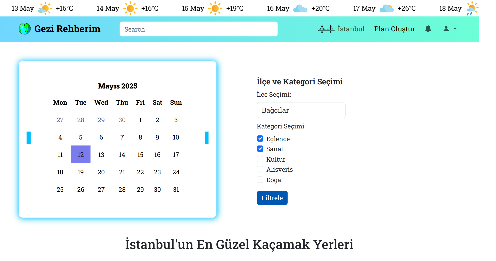
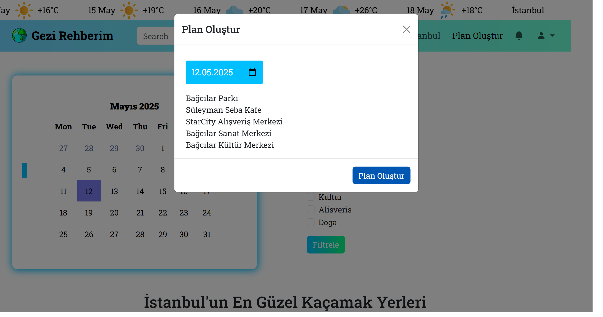
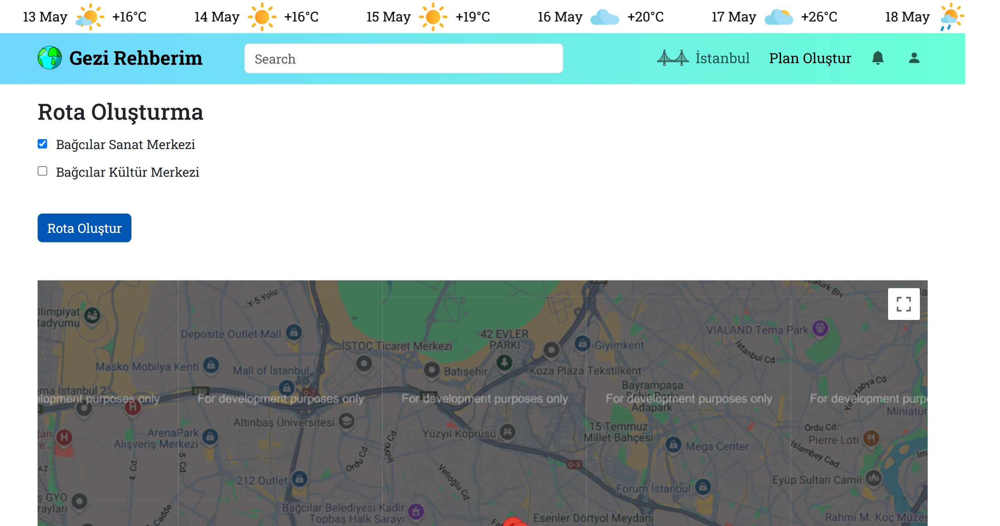
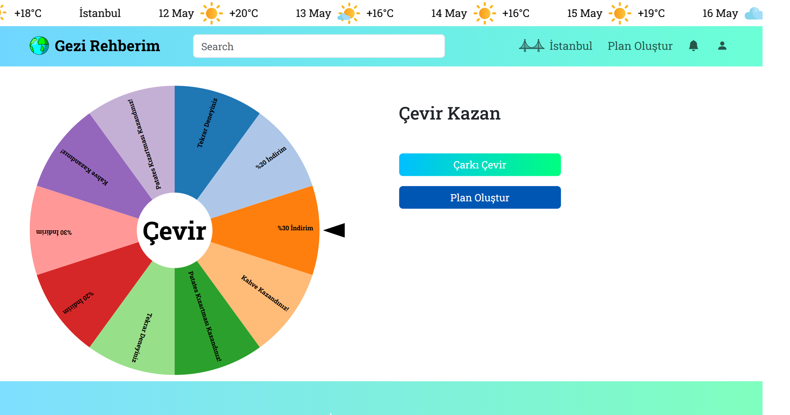

# 🌍 Gezi Rehberim

"Gezi Rehberim", İstanbul’daki gezilecek yerleri ilçe ve kategori bazında filtreleyerek, kullanıcıların kişisel bir gezi planı oluşturmasına yardımcı olan web tabanlı bir seyahat planlama uygulamasıdır.

## 🚀 Özellikler

- İlçe ve kategori seçerek mekan filtreleme  
- Harita üzerinde rota oluşturma  
- Kupon sistemi ile avantajlar sunma  
- Responsive tasarım (mobil uyumlu)  
- Kayıt formu (React ile geliştirilmiştir)  
- TypeScript ile yazılmış etkileşimli bileşenler  

## 🖼️ Ekran Görüntüleri

### Ana Sayfa


### İlçe ve Kategori Seçimi




### Rota Oluşturma


### Kupon Kazan Sayfası


## 🛠️ Kullanılan Teknolojiler

- HTML, CSS, JavaScript, Bootstrap  
- React (sadece form yönetimi için)  
- TypeScript  
- JSON veri ile mekan yönetimi  
- Leaflet.js (harita ve rota oluşturma)

## 📁 Kurulum

Projeyi klonlayarak kendi bilgisayarında çalıştırmak için:

```bash
git clone https://github.com/kullaniciadi/gezi-rehberim.git
cd gezi-rehberim
```

Ardından `index.html` dosyasını bir tarayıcıda açarak projeyi görebilirsiniz.

## ✨ Geliştirici

**Beyza Akbulut**  
📧 beyzakblt@gmail.com  
🔗 [LinkedIn](https://www.linkedin.com/in/beyzakbulut)  
💻 [GitHub](https://github.com/beyzakblt)

